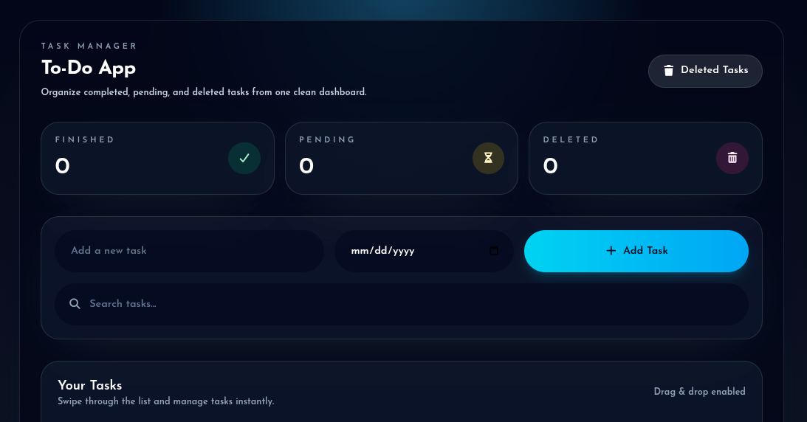

# To-do App

A simple browser-based to-do list application built with TypeScript and vanilla DOM APIs.

[Live Demo →](https://logwithjo.github.io/Todo)




## About

This was my first complete project in my TypeScript learning roadmap.

The main goal was to understand how TypeScript integrates with JavaScript and how type safety improves development.

Looking back, I noticed some weaknesses in the project architecture, particularly duplicated logic and code organization issues. This happened because I initially started with simple features and gradually kept expanding the project without refactoring earlier code.

I considered rebuilding the project from scratch, but I felt that would not be the best use of time. Instead, I decided to focus on learning better architectural patterns in React and applying those lessons to future projects.

---

## Features

* Add tasks with due dates
* Search tasks
* Mark tasks as completed or uncompleted
* Delete tasks with undo support
* Restore deleted tasks from a deleted-tasks popup
* Drag-and-drop task ordering
* View task statistics:

  * Finished tasks
  * Pending tasks
  * Deleted tasks
* Responsive design

---

## Built With

* **HTML5** — page structure
* **CSS3** — styling
* **TailwindCSS** — UI design
* **TypeScript** — type safety and application logic

---

## Getting Started

Just open the live version:

[Launch App →](https://logwithjo.github.io/Todo)

---

## Project Structure

```text
To-do/
├── .gitignore
├── README.md
├── index.html
├── package.json
├── package-lock.json
├── server.js
├── tasks.json
├── tsconfig.json
├── preview.png
├── css/
│   ├── all.min.css
│   ├── style.css
│   ├── task-completed.png
│   └── john-towner-JgOeRuGD_Y4-unsplash.jpg
│
├── webfonts/
│   ├── fa-brands-400.woff2
│   ├── fa-regular-400.woff2
│   ├── fa-solid-900.woff2
│   └── fa-v4compatibility.woff2
│
└── src/
    ├── api.ts
    ├── data.ts
    ├── deletedPageData.ts
    ├── deletedPageDom.ts
    ├── deletedPageUi.ts
    ├── dom.ts
    ├── main.ts
    ├── types.ts
    └── ui.ts
```

---

## What I Learned

* Better project organization and architecture fundamentals
* The importance of avoiding duplicated logic
* Writing cleaner code for easier maintenance and future upgrades
* Understanding how TypeScript works alongside JavaScript
* Patience during development

One of the biggest lessons I learned was not rushing to finish a project just to see the final result. In previous projects, rushing usually left me feeling unsatisfied. For the first time, I took more time with the process, and I’m genuinely happy with the result so far ✨

> Tomorrow will be better.
